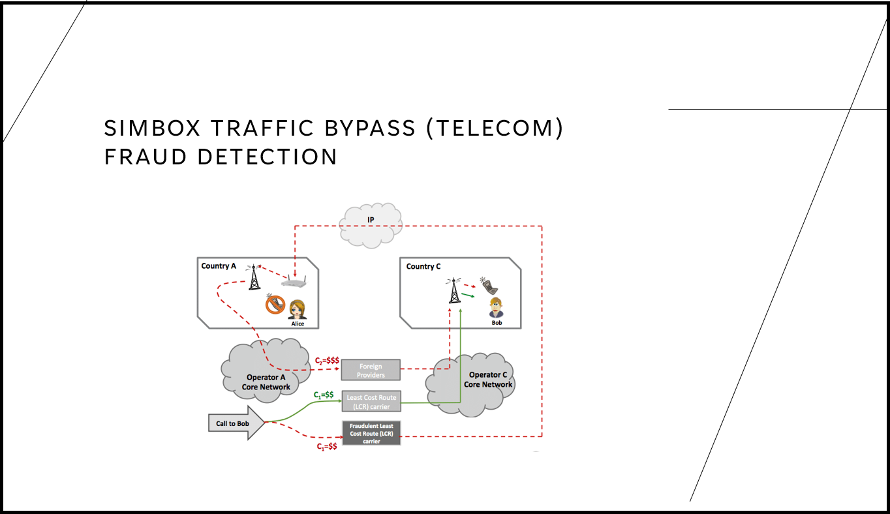

# SimBox Traffic Bypass (Telecom) Fraud Detection

## Repository Link

https://github.com/mubashar856/Simbox-Traffic-ByPass-Detection

## Description

SIM box fraud, also known as interconnect bypass fraud, involves the use of SIM boxes to route international calls as local calls to avoid high interconnection fees. Fraudsters insert multiple SIM cards into a SIM box device, which is connected to a VoIP gateway. This allows them to bypass legitimate network routes, leading to significant revenue losses for telecom operators.

This project aims to detect SIM box fraud by identifying fraudulent MSISDNs (mobile numbers) using machine learning techniques. The data is derived from Call Detail Records (CDRs) over the past seven days. The primary challenge is the highly imbalanced dataset, consisting of 1 million normal users and only 200 fraudulent users. To address this, three approaches were employed:

**Base Model:** Utilized XGBoost to establish a baseline performance.

**Variational Autoencoder (VAE):** Attempted to detect fraud, but the results were unsatisfactory.

**SMOTE and Neural Network:** Applied Synthetic Minority Over-sampling Technique (SMOTE) to generate synthetic fraud data, followed by training a neural network, which yielded better results.

Despite improvements, further work is required to enhance training data transformation and overall model performance.

### Task Type

Classification

### Results Summary

- **Best Model:** Synthetic data generation using SMOTE and Neural Network
- **Evaluation Metric:** F1-Score
- **Result:** F1-score of 0.02

## Documentation

1. **[Literature Review](0_LiteratureReview/README.md)**
2. **[Dataset Characteristics](1_DatasetCharacteristics/exploratory_data_analysis.ipynb)**
3. **[Baseline Model](2_BaselineModel/baseline_model.ipynb)**
4. **[Model Definition and Evaluation](3_Model/README.md)**
5. **[Presentation](4_Presentation/README.md)**

## Cover Image

